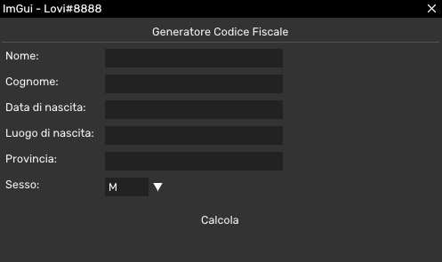

# Generatore di Codice Fiscale

## Panoramica
Questa applicazione permette agli utenti di generare codici fiscali italiani in base alle informazioni personali fornite. Include funzionalità come:

- Suggerimenti automatici per comune e provincia in base all'input dell'utente
- Validazione dei dati in input (es. formato data valido)
- Generazione del codice fiscale completo, inclusa la lettera di controllo

## Funzionalità
1. **Input Utente**: L'applicazione consente all'utente di inserire le seguenti informazioni personali:
   - Nome
   - Cognome  
   - Data di nascita
   - Comune di nascita
   - Provincia di nascita
   - Sesso

2. **Suggerimenti Autocomplete**: Mentre l'utente digita il comune e la provincia, l'applicazione fornisce suggerimenti autocomplete per aiutarlo a trovare la località corretta.

3. **Validazione Dati**: L'applicazione verifica la validità dei dati in input, assicurandosi che la data di nascita sia nel formato corretto e che tutti i campi obbligatori siano compilati.

4. **Generazione Codice Fiscale**: Una volta fornite tutte le informazioni necessarie, l'applicazione genera il codice fiscale completo, inclusa la lettera di controllo.

5. **Grafica**: L'applicazione utilizza la libreria ImGui per fornire un'interfaccia utente pulita e moderna.

## Come Iniziare
Per utilizzare il Generatore di Codice Fiscale, segui questi passaggi:

1. Clona la repository sul tuo computer.
2. Apri il progetto nel tuo ambiente di sviluppo C++ (es. Visual Studio, Visual Studio Code).
3. Compila ed esegui l'applicazione.
4. Inserisci le tue informazioni personali e clicca sul pulsante "Calcola" per generare il tuo codice fiscale.

## Dipendenze
Il Generatore di Codice Fiscale dipende dalla seguente libreria di terze parti:

- [ImGui](https://github.com/ocornut/imgui): Una libreria leggera per interfacce grafiche in modalità immediate-mode per C++.

## Licenza
Questo progetto è concesso in licenza sotto la [Licenza MIT](LICENSE).